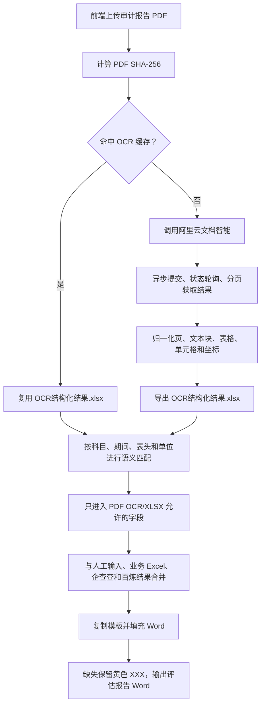

# AssetAppraisal

可配置的资产评估报告 Demo 工作流。页面现在分为两个独立阶段：可选的“RAR/ZIP 审计材料包 → `资产法.xlsx`、`收益法.xlsx`”预处理阶段，以及原有的“审计材料/业务 Excel → 评估报告 Word”阶段。用户也可以完全跳过预处理，直接上传已有 Excel 进入原工作流；找不到的数据在 Word 保留黄色占位符，所有输出均为独立文件，不覆盖模板。

## 安全边界

## 0817 确认版运行规则

1. 节点 1（可选）上传 RAR/ZIP 审计材料包，执行 OCR、规则读取和逐单元格填写，生成 `资产法.xlsx` 与 `收益法.xlsx`。两份结果默认接入节点 2。
2. 节点 2 保留原输入方式：填写委托方、评估主体、评估方法和基准日等人工信息，并接收节点 1 的两份 Excel。用户也可直接上传已有 Excel；手工上传只覆盖对应的资产法或收益法工作簿。
3. 输入路径三选一即可：上传 RAR/ZIP 自动生成两份业务 Excel；直接上传资产法/收益法 Excel；或继续上传多个散装 PDF、Word、Excel 审计材料。
4. 工商信息、股权结构及历史沿革、账外无形资产、企业介绍四类材料分别选择“上传文件”或“企查查 API”。
5. 系统先解析全部材料并建立带文件、页码/工作表/单元格的候选池；重复值一致即去重。审计 PDF 与表格同字段不一致时，结果页会明确列出差异。
6. 每个 Word 字段遵循批注指定的主来源。审计财务表、税率、资产负债范围和账面净资产优先取审计 PDF/OCR；资产/收益/市场法评估结论优先取对应方法工作簿。PDF 未上传或未识别到某字段时，如表格存在唯一语义匹配值则采用表格值并注明“未完成 PDF 对照”；所有材料都无值时才保留黄色 `XXX`。PDF 已填入但与表格不一致时，报告保留 PDF 值、将该数字标红，并加入可定位双方文件及位置的 Word 批注供人工复核。PDF 来源定位优先显示原始 PDF 页码；OCR 页码不足时，受限 LLM 只从已编号 OCR 页面中补充页码，不得生成新页码或改数。
7. LLM 映射代理只在批注规则无法定位的 Word 位置，从已授权字段中选择映射；LLM 不能自造字段、金额或来源。六个企业介绍候选由 LLM 基于已核验材料生成，用户选择后写入 Word。

生成后的 Word 对每一处实际写入的数据保留可视化溯源：浅绿色表示来源及匹配已通过，浅橙色表示已采用可用来源但尚未完成 PDF 对照，浅红色表示来源冲突或 LLM/规则复核存疑；所有材料均无值时保留黄色 `XXX`，同时将 `XXX` 文字标红。批注标题包括 `【来源已核验】`、`【来源待补充核验】`、`【数据冲突，需人工复核】` 和 `【未找到数据】`。每张表使用一条覆盖整个表格选择范围的审核概览：全表正常时说明全部通过；部分异常时说明通过数、不通过数、待人工核对数和缺失数，已定位的异常单元格再附独立具体批注。LLM 调用或返回校验失败时不会虚构某一项不通过，而是将整表标红、把所有非缺失项计入“待人工核对”，并用 `【LLM调用失败，需人工复核】` 提示检查 API Key、模型权限/额度、网络或返回结构。正常单元格不重复堆批注，但每个单元格仍保留自己的状态底色。标题和状态由程序锁定，批注正文由 LLM 在已确认的数值、来源、PDF 页码、Excel 工作表/单元格、企查查或百炼证据范围内组织；LLM 不能改数、改来源或补造位置。模型不可用时保留同信息的确定性批注，不影响 Word 生成。

前端显示两条互不混淆的大进度条。第一条仅表示可选的材料包预处理，并实时显示当前动作：上传校验、安全解压、清点、逐文件 OCR、材料分类、主体匹配、读取系统规则图、资产法映射、收益法映射、本案例映射溯源和结果校验。系统通用规则图由项目预先提供并版本化维护，运行时只读取规则并记录本案例命中的来源页码、目标单元格和处理方式，不会重写通用规则。节点 1 的百分比根据材料数量与类型动态分配：PDF、图片及旧版 Office 的 OCR 权重高于可原生读取的 OOXML 文件，并保证进度只增不退。第二条保留原四节点工作流的细步骤：校验输入、整理材料、OCR/Excel 解析、企查查搜索、来源整合比对、LLM 候选和批注生成、逐字段/逐表填充、写入批注、检查黄色 `XXX` 以及最终 Word 文件校验。

仓库只提交业务内核、配置、Prompt、测试和前端示例。以下内容不会提交：

- `.env`、本地 API Key/SecretKey 和前端本地环境文件；
- `资产评估工作流/` 中的审计报告、Word 模板、Excel、OCR 材料等客户文件；
- `runs/`、`outputs/`、`uploads/`、`cache/` 运行产物和上传文件。

首次使用：

```bash
cp .env.example .env
# 在 .env 中填写本机凭证；不要把 .env 加入 Git
uv sync --extra dev
```

完整流程、配置格式、前端启动和 c2m 接入方式见 [demo/README.md](demo/README.md)。

当前默认模板为 `templates/评估报告版式_0817确认.docx`，对应批注规则版为 `templates/评估报告版式-映射批注_0817确认.docx`。批注只用于建立“Word位置→字段→来源”映射，不会出现在最终报告正文。运行时至少提供以下一种：已完成的 RAR/ZIP 预处理任务、直接上传的资产法/收益法 Excel、或散装审计报告材料；四类补充材料按需上传。

## 需要的外部服务及获取方式

### 企查查

在企查查开放平台购买并创建以下接口，复制平台生成的 `Key` 和 `SecretKey` 到本地 `.env`：

| ApiCode | 用途 | 购买/查看地址 |
| --- | --- | --- |
| 735 | 企业工商详情（委托方、被评估单位工商表） | [企业工商详情](https://openapi.qcc.com/dataApi/735) |
| 231 | 全国商标查询 | [全国商标查询](https://openapi.qcc.com/dataApi/231) |
| 514 | 专利查询 | [专利查询](https://openapi.qcc.com/dataApi/514) |
| 233 | 著作权/软件著作权查询 | [著作权软著查询](https://openapi.qcc.com/dataApi/233) |
| 2001 | 企业信息核验，补充行业、经营范围和企业规模证据 | [企业信息核验](https://openapi.qcc.com/dataApi/2001) |
| 213 | 企业年报，补充经营及年报证据 | [企业年报](https://openapi.qcc.com/dataApi/213) |
| 886 | 按产品、经营范围等关键词检索同行业企业候选 | [企业模糊搜索](https://openapi.qcc.com/dataApi/886) |
| 915 | 按业务关键词检索上市公司公告及股票代码 | [上市公告搜索](https://openapi.qcc.com/dataApi/915) |
| 699 | 为已核验的上市候选补充行业、上市信息、注册信息和估值指标 | [上市企业](https://openapi.qcc.com/dataApi/699) |

对应环境变量：

```dotenv
QICHACHA_APP_KEY=你的Key
QICHACHA_SECRET_KEY=你的SecretKey
# 留空时调用 735/231/514/233/2001/213；可显式限制补充证据接口
QICHACHA_EXTRA_API_CODES=2001,213
```

接口地址和路径已经写入程序默认配置，用户只需配置统一的 `QICHACHA_APP_KEY` 和 `QICHACHA_SECRET_KEY`。启用 `--use-qichacha` 时，企查查优先在节点 3 调用：默认调用 735、231、514、233、2001、213；前四项填工商及知识产权表，后两项作为百炼叙述证据。对被评估主体，节点 3 会从 API 返回的经营范围中提取短业务关键词，再调用 886→915→699；只有同时带企业名称、股票代码、公告标题和公告日期的 915 上市公告，才会成为“对标上市公司”候选。699 默认使用官方 `/IPO/GetIPODetail`，按股票代码补充同一候选的行业、上市日期、证券类别、注册信息、市盈率、市净率及发行信息；699 返回没有主营业务字段，相关业务描述继续由工商、年报、公告和上传材料交给 LLM 综合。候选会去重、限制为五家，并明确标注为关键词命中候选而不是最终可比性认定；被评估主体自身不会作为对标上市公司写入。单个 699 请求失败只缺少该候选的补充维度，不影响其他模块和 Word 生成。经主体名称校验的响应会保存为运行目录内部快照；节点 4 优先复用有效快照，只对节点 3 未取得或身份校验失败的主体再次调用接口补充。可用 `QICHACHA_ENABLE_COMPARABLE_DISCOVERY=false` 关闭对标公司发现。962、521、723、724、1124 等面议接口不调用。客户、供应商没有 PDF/XLSX 等可靠证据时会写明“未披露”，不由 LLM 编造。

### 百炼模型

在[阿里云百炼控制台](https://bailian.console.aliyun.com/)开通兼容 OpenAI 接口并创建 API Key。默认先调用 `deepseek-v4-pro-0813`；该次调用失败时自动改用 `qwen3.8-max`，两个模型和网关都可以自行修改：

```dotenv
DASHSCOPE_API_KEY=你的百炼APIKey
APPRAISAL_LLM_MODEL=deepseek-v4-pro-0813
APPRAISAL_LLM_FALLBACK_MODEL=qwen3.8-max
```

项目配置可以分别为 `narrative`（六个企业介绍候选）和 `evidence_review`（取数证据复核）指定模型；未指定时统一使用 `default_model`，环境变量可用 `APPRAISAL_LLM_MODEL_NARRATIVE`、`APPRAISAL_LLM_MODEL_EVIDENCE_REVIEW` 分别覆盖。`APPRAISAL_LLM_FALLBACK_MODEL` 仅在主模型请求失败时启用，不会混合两种模型的文本。

公司概况在有确定证据时自动写入。第二节点固定展示并让用户选择六个可选模块：所处行业及行业介绍、业务内容及细分市场、主要产品、主要客户及供应商、盈利模式和SWOT分析、对标上市公司（列表多维度展示）。LLM 不逐句复制 API/PDF/Excel，而是在证据边界内进行专业归纳、结构组织和审慎分析；可根据明确业务事实分析盈利模式和 SWOT，但不得虚构公司、客户、供应商、金额或市场数据。用户勾选的是“哪些候选写入 Word”，不是重新选择 API。

例如切换到其他模型，只改 `APPRAISAL_LLM_MODEL`。Prompt 和结构化输出契约分别位于：

- `demo/prompts/yellow_narratives.v3.txt`
- `demo/prompts/yellow_narratives_output.v3.json`
- `demo/prompts/evidence_review.v1.txt`
- `demo/prompts/evidence_review_output.v1.json`
- `demo/prompts/word_review_comment.v2.txt`
- `demo/prompts/word_review_comment_output.v2.json`

取数复核会对每个已找到的 PDF/OCR 或 Excel 逻辑字段/表格，读取候选的科目、期间、单位、口径、文件及定位信息，返回 `accept`、`needs_review`、`conflict` 或 `missing`。它没有修改数值、修改来源或生成新字段的权限；出现 `needs_review`/`conflict`/`missing` 时，报告会使用浅红底色和 `【数据冲突，需人工复核】` 批注供人工查看。模型超时、返回空结果、非法状态或不符合结构时，程序会保留原值和原来源并自动生成 `needs_review`，保证每个已送审字段都有受控状态；规则已经标记存在差异的字段也不接受模型返回的 `accept`。批注使用真实文件名、PDF 页码或 Excel 工作表，不展示 `asset_scope_summary_table`、`income_workbook.xlsx` 等内部临时名称。

批注不会再按“第一个相同金额”定位。确定性规则先用目标 Word 表格、科目行、期间列和段落上下文定位具体金额，再把字段、采用值、PDF/Excel 双方证据和真实金额候选交给受限 LLM 复核。LLM 不负责凭空找位置，只判断规则找到的金额是否属于正确表格、科目和期间，并根据完整证据生成简洁、可执行的中文复核批注。复核有疑点时，该具体金额标红并由 LLM 说明期间、口径或科目疑点；重复金额仍无法唯一确认时，放弃该批注，不改挂科目行名、期间表头或章节标题。多个事项命中同一具体金额时，合并为同一批注内的“复核项 2/3…”。

修改模型时应保持输出字段白名单和 JSON 结构；如项目后端配置了参考资料，叙述生成会先检索相关证据，再按公司概况和六个可选模块分别调用模型并在本地校验证据编号。参考报告不是前端运行时上传项。业务代码不会读取 `.env` 创建全局客户端，凭证只在 CLI/API 入口注入。

### OCR

OCR 在本工作流中只负责把审计报告 PDF 转换为可以检索、匹配和追溯的结构化证据。它不会直接决定 Word 应填什么，也不会替代资产基础法/资产清查 Excel、收益法或市场法 Excel、企查查、百炼及黄色字段来源规则。

完整链路如下：



#### 1. 开通与配置

PDF OCR 默认使用阿里云文档智能“文档解析（大模型版）”，本机不会加载 PaddleOCR。先在[文档智能控制台](https://docmind.console.aliyun.com/)开通“文档理解 → 文档解析（大模型版）”，再给持有 AccessKey 的专用 RAM 用户授权。

阿里云官方文档中的系统策略名称为 `AliyunDocmindFullAccess`。若当前 RAM 控制台没有显示该系统策略，可创建只覆盖文档智能产品的自定义策略并授予同一个 RAM 用户：

```json
{
  "Version": "1",
  "Statement": [
    {
      "Effect": "Allow",
      "Action": ["docmind:*"],
      "Resource": "*"
    }
  ]
}
```

授权和自定义策略可分别参考[文档智能服务鉴权指南](https://help.aliyun.com/zh/document-mind/getting-started/service-authentication-guide)与[文档智能自定义权限策略参考](https://help.aliyun.com/zh/document-mind/security-and-compliance/document-smart-custom-permission-policy-reference)。

本地 `.env` 配置为：

```dotenv
APPRAISAL_OCR_PROVIDER=aliyun
ALIBABA_CLOUD_ACCESS_KEY_ID=你的RAM AccessKey ID
ALIBABA_CLOUD_ACCESS_KEY_SECRET=你的RAM AccessKey Secret
APPRAISAL_OCR_VLM=false
APPRAISAL_OCR_TIMEOUT_SECONDS=900
```

基础链路适用于普通审计报告；复杂扫描件可将 `APPRAISAL_OCR_VLM` 改为 `true`，但费用和处理时间会增加。AccessKey 只从 `.env` 或生产宿主环境注入，不进入业务代码、Word、内部运行状态或 Git。

#### 2. 缓存与 OCR 提供方选择

上传 PDF 后，前端会立即查询 OCR 缓存。缓存使用 PDF 内容的 SHA-256，而不是文件名判断：

1. 命中时直接读取已有 `OCR结构化结果.xlsx`，不会再次消耗云端页数；
2. 未命中时调用当前配置的 OCR 提供方；
3. 缓存文件损坏且仍有原 PDF 时，记录缓存问题并尝试调用当前提供方；
4. 未上传 PDF 时，`ocr_pdf` 和 `export_ocr_workbook` 节点标记为 `skipped`，其余材料仍继续处理。

提供方配置：

- `APPRAISAL_OCR_PROVIDER=aliyun`：默认模式，调用阿里云文档智能，本机不加载 PaddleOCR；
- `APPRAISAL_OCR_PROVIDER=paddle`：显式启用原本地高内存模式，需要安装 `--extra ocr`；
- `APPRAISAL_OCR_PROVIDER=none`：完全跳过 PDF OCR。

云端失败时不会自动回退本地 PaddleOCR，避免突然占用大量本机内存。

#### 3. 阿里云解析和统一结构

缓存未命中时，适配器按阿里云异步接口执行：

1. 使用 `SubmitDocParserJobAdvance` 上传本地 PDF；
2. 轮询 `QueryDocParserStatus`，直到成功、失败或超时；
3. 使用 `GetDocParserResult` 分页获取全部版面块；
4. 把阿里云返回转换为本项目统一的页、文本块、表格和单元格结构；
5. 在服务实际返回的范围内保留页码、块/表格编号、行列、跨行跨列、坐标、置信度和证据位置。

统一后会生成独立的 `OCR结构化结果.xlsx`，固定包含：

- `OCR_文本`：逐页文本块及位置；
- `OCR_表格`：逐单元格明细及页码、行列和证据编号；
- `标准财务数据`：经过财务别名、期间和单位规则归一化的候选值；
- `识别问题`：OCR、结构转换和字段解析的内部状态，不作为用户输出；
- 表格索引及按页恢复的矩阵表：保留原表格行列形状，便于人工查看和继续匹配。

#### 4. OCR Excel 与两类业务 Excel

前端涉及的三类工作簿不是同一个文件，也不能相互替代：

| 工作簿 | 来源 | 是否由用户上传 | 主要用途 |
| --- | --- | --- | --- |
| `OCR结构化结果.xlsx` | 审计报告 PDF 的 OCR 结果 | 否，系统自动生成或复用 | 审计报告文本、表格、标准财务候选值和 OCR 问题 |
| 资产基础法/资产清查 Excel | 项目业务材料 | 可选 | 资产基础法、资产清查、长期资产和相关上报数据 |
| 收益法或市场法 Excel | 项目业务材料 | 可选 | 收益法或市场法测算过程及评估结论 |

用户上传的工作簿文件名可以不同；前端按材料角色传递，后端再根据工作表内容判断具体版式。`OCR结构化结果.xlsx` 是运行中间件，不需要也不应由用户重复上传。

#### 5. 从 OCR/Excel 到 Word

OCR 或业务 Excel 中的非空数字不会直接写入 Word。系统先根据以下信息定位候选值：

- 工作表内容和表格标题；
- 科目名称及别名；
- 历史年度、评估基准日和预测期间；
- 账面价值、账面净值、评估价值等列类型；
- 元、千元、万元等金额单位；
- 资产基础法、收益法和市场法特征。

通用语义识别是唯一的网页运行路径：先扫描上传 Excel/OCR 工作簿的表格标题、科目、列类型、期间和单位，再选择带来源单元格的候选值；不会读取开发机上的旧工作表坐标。出现多个同等合理的候选值、疑似尚未完成的全零评估列或证据冲突时，系统不根据相邻非零数字猜测，相关字段保持未解决。后续可启用受控 LLM 定位器：它只能在已扫描的候选单元格中选择并返回证据位置，不能生成金额。

每个接受的值都会在内部保留“来源文件 + 工作表/单元格”或“PDF/OCR 页码 + 表格/单元格证据”。黄色字段还要经过来源白名单：PDF OCR/XLSX 字段只能接收这一来源允许的数据，不得由企查查、百炼或其他材料跨来源冒填。

#### 6. 缺失、失败与最终输出

以下情况都不会阻止生成 `资产评估报告_待复核.docx`：

- 没有上传 PDF；
- 阿里云凭证缺失、无权限、超时、额度不足或解析失败；
- OCR/Excel 没有找到字段；
- 同一字段存在无法自动裁决的冲突。

缺失位置保留或写入黄色 `XXX`；冲突候选不自动选择。系统继续输出评估报告 Word，供人工直接复核。

OCR 所处的完整资产评估工作流为：

```text
节点1：人工输入 + 审计 PDF/OCR + 两类业务 Excel
→ 节点2：OCR/XLSX/API解析 + 百炼生成全部候选，人工选择
→ 节点3：优先复用节点2结果，缺失的企查查主体允许补查，再填充 Word
→ 节点4：评估报告 Word
```

这就是本仓库最初定义的可复用资产评估报告业务内核。用户、权限、任务队列、持久化、并发、监控和发布仍由 c2m 或其他生产外壳实现，不属于 Demo 业务内核。

## 本地运行示例

命令行的 `--pdf` 可省略以便离线调试；Web 工作台允许以已完成的材料包预处理、直接上传的业务 Excel 或散装审计材料进入原工作流。没有可 OCR 的 PDF，或 PDF 未识别到某字段时，若业务 Excel 存在唯一语义匹配值，则采用该值并增加“未完成 PDF 对照”的来源批注；所有材料都没有可靠值时才保留黄色 `XXX`。

```bash
uv run --python 3.11 python -m demo.run demo/projects/tongfu.yaml \
  --pdf "资产评估工作流/审计报告.pdf" \
  --template "templates/评估报告版式_0817确认.docx" \
  --output-dir runs/local \
  --use-glm --use-qichacha \
  --commissioning-party-name "委托方全称" \
  --commissioning-party-short-name "委托方简称" \
  --valuation-base-date "2025-06-30" \
  --valuation-purpose-inputs "评估目的" \
  --selected-valuation-method "收益法、资产基础法" \
  --valuation-subject-type "股东全部权益价值" \
  --transaction-type "收购" \
  --final-valuation-method "收益法" \
  --target-company-name "被评估单位全称" \
  --target-company-short-name "被评估单位简称"
```

API、OCR、LLM 和人工输入的字段边界由 `demo/projects/*.yaml` 与 `demo/workflow.yaml` 配置；新增项目优先复制配置并修改映射，不要把客户材料提交到仓库。

## 前后端启动

先在项目根目录准备 `.env`，然后启动后端：

```bash
uv sync --python 3.11 --extra dev --extra services --extra web
uv run --python 3.11 uvicorn demo.api_server:app --host 127.0.0.1 --port 8000
```

另开一个终端启动前端：

```bash
cd frontend
npm install
npm run dev -- --host 127.0.0.1 --port 5173
```

浏览器打开 <http://127.0.0.1:5173/>。前端默认把 `/api` 请求代理到 `http://127.0.0.1:8000`；如需修改，可在 `frontend/.env` 中设置 `VITE_API_PROXY_TARGET`，该文件不会提交到 Git。生产构建使用：

前端提供两个大阶段。可选阶段上传 RAR/ZIP，生成并下载 `资产法.xlsx`、`收益法.xlsx`；原阶段继续接受审计报告 PDF、资产法 Excel、收益法 Excel 和补充材料。文件名可以不同，后端按上传槽位及工作表语义识别角色。提交时用户上传的某一份 Excel 只覆盖同角色自动生成版，未上传的另一份继续沿用生成版；Word 模板始终使用后台版本，不接受用户上传。

人工基础信息严格对应最新图片中的九项：委托方全称/简称、委托类型（转让/收购/增资/减资单选）、评估主体全称/简称、评估对象（四选一）、评估方法（资产基础法/收益法/市场法多选且至少一个）、评估结论采用方法（单选）、评估基准日。

Word 模板由后端固定提供，不需要用户上传。参考评估报告 DOCX 仅用于开发期比对或后台项目配置，不属于前端输入；`OCR结构化结果.xlsx` 由系统根据 PDF 生成或复用，也不需要用户上传。两个业务 Excel 会覆盖本次任务对应的项目材料路径，生成结果不会修改原文件。常见资产基础法、收益法和市场法表会按工作表特征、科目标签、列标题及元/万元自动定位，项目特有字段才需要补充项目映射。

生成 Word 后只提供评估报告 Word；LLM 候选仅在第二节点暂停时用于页面内选择，不作为最终下载文件。工作流契约不合法、模板缺失或模板结构错误时停止生成；普通材料缺失、损坏、字段无结果或布局不匹配时继续生成待复核报告。不会生成三类 LLM 审核文件，也不会另存“最终候选” Word。

```bash
cd frontend
npm run build
```

### ECS 生产部署（公网 8003）

不要在公网使用 `npm run dev`。Vite 开发服务器会把依赖拆成大量未做生产优化的模块请求，网络延迟会显著放大首屏时间。构建后使用 Nginx 提供静态文件：

```bash
cd /opt/AssetAppraisal/frontend
npm ci
npm run build

# 若仓库不在 /opt/AssetAppraisal，先修改配置中的 root 路径。
sudo cp nginx.conf.example /etc/nginx/conf.d/asset-appraisal.conf
sudo nginx -t
sudo systemctl reload nginx
```

示例配置监听公网 `8003`、将 `/api/` 反向代理至本机后端 `127.0.0.1:8000`，并为带内容哈希的 `/assets/` 开启长期缓存和 gzip。阿里云安全组只需向可信来源开放 `8003`；后端 `8000` 建议仅监听本机，不直接暴露公网。以后每次更新前端，只需重新执行 `npm ci && npm run build`，无需运行 Vite 开发服务器。

## Pipeline 建议（可复用）

仓库目前的标准交付链路建议固定为三段：解析脚本验证、前端构建验证、运行与联调。按这个顺序执行可以稳定复现结果。

1. `backend pipeline`（后端流水线）
   - `uv sync --extra dev --extra services --extra web --python 3.11`
   - `uv run --python 3.11 pytest`
2. `frontend pipeline`（前端流水线）
   - `cd frontend`
   - `npm install`
   - `npm run build`
3. `e2e 本地联调`（与生产口径一致）
   - `uv run --python 3.11 uvicorn demo.api_server:app --host 127.0.0.1 --port 8000`
   - `cd frontend && npm run dev -- --host 127.0.0.1 --port 5173`
   - 打开 `<http://127.0.0.1:5173/>`，按“RAR 预处理 + 节点2 手工提交”闭环跑一次

如果你的团队后续接 CI，可把上述 1 和 2 固定为构建阶段，启动命令保留为部署环境的运行阶段。  
当前仓库未内置固定 CI 流水线文件，以上命令是对现有目录结构的推荐 pipeline 模板。
