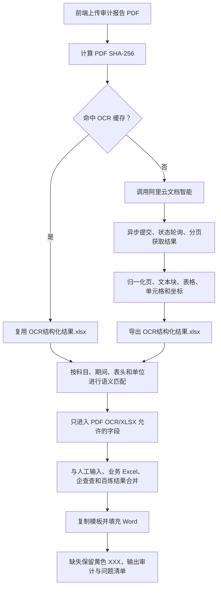

# README OCR Workflow Guide Implementation Plan

> **For agentic workers:** REQUIRED SUB-SKILL: Use superpowers:executing-plans to implement this plan task-by-task. Steps use checkbox (`- [ ]`) syntax for tracking.

**Goal:** Expand the root README OCR section into an accurate end-to-end explanation of how an audit PDF becomes structured OCR evidence and then contributes to a reviewable appraisal Word report.

**Architecture:** Keep the root README self-contained while preserving `demo/README.md` as the deeper operational reference. Replace the short OCR explanation with a flow diagram and focused subsections for service setup, cache/provider selection, normalized output, workbook boundaries, field resolution, failure handling, and the relationship to the complete appraisal workflow.

**Tech Stack:** Markdown, Mermaid, the existing Python/Vue workflow documentation.

---

### Task 1: Expand the root README OCR section

**Files:**
- Modify: `README.md`
- Reference: `demo/workflow.yaml`
- Reference: `demo/pipeline.py`
- Reference: `demo/api_server.py`
- Reference: `frontend/src/domain/upload-fields.js`

- [ ] **Step 1: Replace the short OCR introduction with the exact workflow boundary**

State that OCR converts only the audit-report PDF into structured evidence. It does not replace the two business Excel workbooks, Qichacha, Bailian, field-source routing, or Word formatting.

- [ ] **Step 2: Add the end-to-end Mermaid flow**

Use these nodes and branches:



- [ ] **Step 3: Document provider selection and cache behavior**

Explain:

- no PDF means the OCR node is skipped;
- cache reuse is keyed by PDF SHA-256;
- a cache miss uses Alibaba Cloud Document Mind by default;
- `APPRAISAL_OCR_PROVIDER=paddle` is an explicit high-memory local fallback;
- `APPRAISAL_OCR_PROVIDER=none` skips OCR;
- a failed cache read may call the configured provider when the PDF is available.

- [ ] **Step 4: Document the Alibaba Cloud request lifecycle**

List the actual lifecycle:

1. upload the local PDF with `SubmitDocParserJobAdvance`;
2. poll `QueryDocParserStatus`;
3. page through `GetDocParserResult`;
4. normalize provider-specific output;
5. retain page number, block/table identity, row, column, span, coordinates, confidence, and evidence location where available.

- [ ] **Step 5: Explain the three workbook roles**

Add a compact table:

| 工作簿 | 来源 | 是否由用户上传 | 用途 |
| --- | --- | --- | --- |
| `OCR结构化结果.xlsx` | 审计 PDF OCR | 否 | OCR 文本、表格、标准财务数据和识别问题 |
| 资产基础法/资产清查 Excel | 项目材料 | 可选 | 资产基础法、资产清查、长期资产等 |
| 收益法或市场法 Excel | 项目材料 | 可选 | 收益法或市场法测算与结论 |

State that filenames may vary and that the workbooks are not interchangeable.

- [ ] **Step 6: Explain semantic matching, routing, and evidence**

Describe matching by worksheet content, table title, subject label, period, column meaning, and monetary unit. State that configured verified coordinates are compatibility fallbacks, ambiguous candidates remain unresolved, and every accepted value carries its source file plus worksheet/cell or OCR evidence into the field audit list.

- [ ] **Step 7: Explain failure and output behavior**

State that missing credentials, timeout, quota exhaustion, provider failure, missing values, or ambiguous values do not block `资产评估报告_待复核.docx`. Missing values remain yellow `XXX`; conflicts are not guessed; issues are exported with Word page/location. Only a complete, unresolved-placeholder-free and reviewed run can create `资产评估报告_最终候选.docx`.

- [ ] **Step 8: Update RAM authorization guidance**

Keep the official `AliyunDocmindFullAccess` guidance and add a current-console fallback:

```json
{
  "Version": "1",
  "Statement": [
    {
      "Effect": "Allow",
      "Action": ["docmind:*"],
      "Resource": "*"
    }
  ]
}
```

Explain that this custom policy is used only when the system policy is not visible and must be granted to the RAM user that owns the AccessKey.

- [ ] **Step 9: Add the complete workflow summary**

Close the OCR section with:

```text
人工输入 + 审计 PDF/OCR + 两类业务 Excel + 企查查 + 百炼
→ 字段来源白名单与语义映射
→ 固定 Word 模板填充
→ 格式审核、数据校验、语义审核
→ 待复核报告、字段审计清单、带页码问题清单
```

Clarify that this is the reusable appraisal-report business core; production identity, permissions, queues, storage, monitoring, and release remain the responsibility of c2m or another production shell.

### Task 2: Validate and publish the documentation

**Files:**
- Verify: `README.md`
- Verify: `demo/specs/2026-07-28-readme-ocr-flow-design.md`

- [ ] **Step 1: Scan for contradictions and forbidden secrets**

Run:

```bash
rg -n "OCR结构化结果|APPRAISAL_OCR_PROVIDER|docmind|PaddleOCR|黄色 XXX|最终候选" README.md
git grep -n -E "LTAI|AccessKey Secret=[^你]" -- README.md
```

Expected: every required concept is present and no real credential is found.

- [ ] **Step 2: Check Markdown whitespace and repository state**

Run:

```bash
git diff --check
git status --short
```

Expected: no whitespace error; only the planned README/plan changes and the user's existing untracked `docs/plans/` remain.

- [ ] **Step 3: Commit the README and plan**

Run:

```bash
git add README.md demo/specs/2026-07-28-readme-ocr-flow-plan.md
git commit -m "docs: explain end-to-end ocr workflow"
```

Expected: one documentation commit containing no customer material or credentials.

- [ ] **Step 4: Push the current main branch**

Run:

```bash
git push origin main
```

Expected: GitHub `main` advances to the documentation commit.
