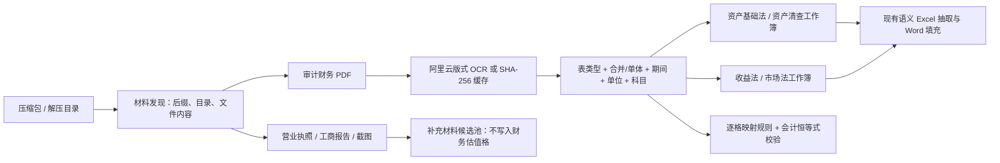

# 审计材料到评估工作簿的通用归集设计

## 目标

用户上传的是一个包含审计报告、营业执照、工商报告、图片和可能的评估底稿的压缩包，而不是已经分好角色的两份 Excel。本设计将解压后的材料转换为两类可被现有语义读取器消费的工作簿：

- `资产基础法_资产清查.xlsx`：资产负债表、所有者权益变动表、资产明细和资产评估结果表；
- `收益法_市场法.xlsx`：利润表、现金流量表、收益法估值表和市场法估值表。

审计报告只提供账面财务事实，不能据此生成资产基础法评估价值、折现率或收益法结论。没有直接证据时，对应工作簿应写入待补充原因，而不是填写零或估计数。

## 归类规则

目录和文件名只是候选提示，最终以 OCR 表名、页内标题和行列语义判定。

| 识别到的内容 | 写入角色 | 单元格规则 |
| --- | --- | --- |
| 资产负债表、资产明细、固定资产/无形资产/存货/长期股权投资附注 | 资产基础法/资产清查 | 源值直取，保留审计 PDF 页、表、行、列 |
| 所有者权益变动表 | 资产基础法/资产清查 | 源值直取；可供账面净资产复核 |
| 利润表、损益表、现金流量表 | 收益法/市场法 | 源值直取，按报表期间保留 |
| 明确包含“资产基础法”“评估价值”“评估汇总”的表 | 资产基础法/资产清查 | 可写入评估列；全零评估列仍视为未完成 |
| 明确包含“收益法”“自由现金流”“折现率”“股东全部权益价值”或“市场法”“可比公司”的表 | 收益法/市场法 | 仅接受已出现的估值参数/结论，不从审计表反推 |
| 营业执照、天眼查报告、截图 | 补充材料候选池 | 不写入两类财务工作簿，供工商、股权和企业介绍字段使用 |

## 映射与计算边界

每个生成工作簿都有 `映射规则` 工作表：`目标工作表/单元格 → 源文件/页码/表格/行/列 → 源值直取或公式 → 证据等级`。数值先按原单位写入，不在拷贝时悄然转换；下游语义读取器根据显式单位统一换算。

可自动生成的公式只限于材料内可验证的会计恒等式，例如：

- `资产总计 = 流动资产合计 + 非流动资产合计`；
- `负债合计 = 流动负债合计 + 非流动负债合计`。

这些公式被写入 `核验计算` 工作表，结果为零才标记通过。评估增值、折现率、预测现金流、可比倍数和最终评估结论没有材料直接支持时必须保持待补充。
