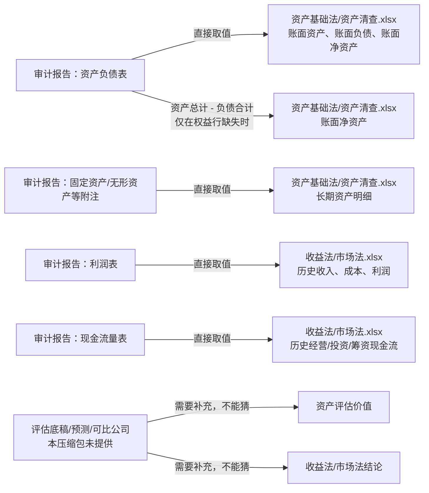

# 审计材料到两份业务工作簿：映射总表

这张表回答唯一的问题：**压缩包中的信息，应该进入哪份 Excel；是直接取，还是计算后写入。**

> 本批压缩包没有资产评估明细底稿、收益预测、折现率或可比公司估值资料。因此，它只能填入两份工作簿中的“审计账面数据/历史数据”部分，不能自动算出评估结论。

| 压缩包中的信息 | 目标 Excel | 目标内容 | 写入方式 | 是否允许自动计算 |
| --- | --- | --- | --- | --- |
| 审计报告的资产负债表：流动资产、非流动资产、资产总计 | `资产基础法/资产清查.xlsx` | 账面资产及资产负债范围 | 直接取该表对应期间的金额 | 否 |
| 审计报告的资产负债表：流动负债、非流动负债、负债合计 | `资产基础法/资产清查.xlsx` | 账面负债及资产负债范围 | 直接取值 | 否 |
| 审计报告的资产负债表：所有者权益/净资产 | `资产基础法/资产清查.xlsx` | 账面净资产 | 有原行则直接取值 | 仅当原行缺失时，`资产总计 - 负债合计` |
| 审计报告附注：固定资产、无形资产、长期股权投资、存货等 | `资产基础法/资产清查.xlsx` | 长期资产账面明细 | 直接取值；保留附注页码和科目 | 否 |
| 审计报告的利润表：营业收入、营业成本、费用、营业利润、净利润 | `收益法/市场法.xlsx` | 历史利润表 | 直接取值 | 否 |
| 审计报告的现金流量表：经营/投资/筹资活动现金流 | `收益法/市场法.xlsx` | 历史现金流量表 | 直接取值 | 否 |
| “期末余额/上年年末余额”列 | 两份 Excel | 标准期间列 | 页头报表日期 → 本期；同日上一年 → 上期 | 是，只有期间标签归一化 |
| “本期金额/上期金额”列 | `收益法/市场法.xlsx` | 标准年度列 | 页头“2024年度” → `2024年度`；上期 → `2023年度` | 是，只有期间标签归一化 |
| 资产评估价值、评估增值率 | `资产基础法/资产清查.xlsx` | 评估结果列 | 本压缩包无来源 | **不允许计算** |
| 折现率、预测收入/利润/现金流、收益法价值 | `收益法/市场法.xlsx` | 收益法模型与结论 | 本压缩包无来源 | **不允许计算** |
| 可比公司、PE/PB/EV 倍数、市场法价值 | `收益法/市场法.xlsx` | 市场法模型与结论 | 本压缩包无来源 | **不允许计算** |
| 营业执照、天眼查报告、截图 | 不写入这两份财务 Excel | 工商、股权、企业介绍候选池 | 直接提取文字/证照字段 | 不适用 |

## 一个具体例子

`信会师报字[2025]第ZA12371号.pdf` 第 8 页的“合并资产负债表”中：

- `货币资金`、`流动资产合计`、`非流动资产合计`、`资产总计` → `资产基础法/资产清查.xlsx` 的资产负债表；**直接取值**。
- `期末余额` → `2024-12-31`，`上年年末余额` → `2023-12-31`；这是**列期间归一化**，不是金额计算。
- 只有审计表未提供“所有者权益”时，才可用 `资产总计 - 负债合计` 计算账面净资产；该计算会在 `核验计算` 中保留公式。
- 审计报告第 12 页的“合并利润表” → `收益法/市场法.xlsx` 的历史利润表；**直接取值**。

因此，“旧 Excel 可能怎样填”的合理推断是：它先收集审计账面历史数据，再由评估师另行补入资产评估底稿或收益/市场法模型。审计报告本身不是评估模型。
