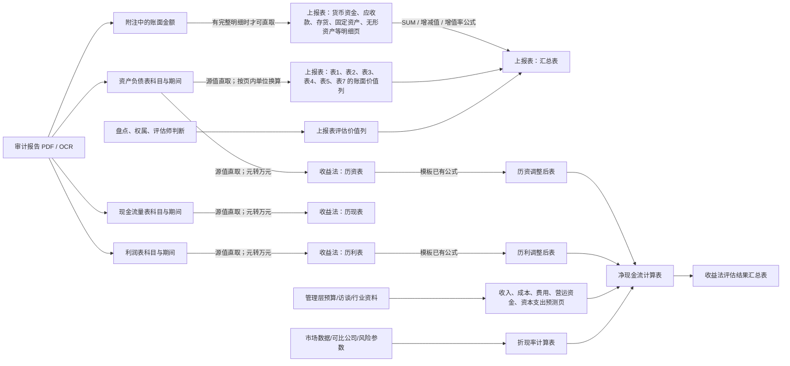

# 审计材料到真实评估模板：通用映射图

## 映射方式

| 模板区域 | 来自审计报告时的规则 | 不能从审计报告生成的内容 |
|---|---|---|
| 上报表的账面价值列 | 按科目别名匹配资产负债表；源为元、目标为万元时做确定性单位换算 | 无 |
| 上报表的资产/负债明细 | 只有审计附注实际给出明细行时写入；否则账面汇总可填，明细留空 | 银行账号、客户账龄、设备编号、实物数量、权属和评估价值 |
| 上报表的增减值、增值率 | 模板公式：评估价值－账面价值；增减值÷账面价值 | 评估价值本身 |
| 收益法的历资/历利/历现表 | 以评估基准日最近的审计期间填入最新实际列，前期填入上一实际列；金额统一为万元 | 早于报告覆盖范围的历史期 |
| 收益预测和净现金流 | 历史实际值只能作为起点；模板公式保留 | 未来收入、成本、费用、资本开支、营运资金假设 |
| 折现率和评估结果 | 保留模板公式与空输入位 | WACC 参数、可比公司、终值、收益法评估值 |

每个输出工作簿的 `AI映射规则` 工作表是上图的逐单元格展开：包含目标单元格、源 PDF 页/表/行列、单位换算或公式、以及“已填/待补充”状态。
