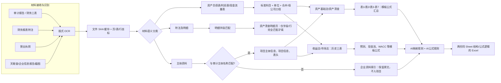

# 通用审计材料到两类评估工作簿规则

本规则不依赖公司名称、文件名或模板中的样例数字。输入可以是任意一包审计报告、财务报表附注、营业执照、企业信息报告及截图；输出始终复制两份已批准的模板，只向有可追溯证据的单元格写值。

## 写入判定

| 规则 | 允许的动作 |
| --- | --- |
| 审计三表中存在同一标准科目，且口径不冲突 | 直取；按源页和目标页的元/万元换算；记录文件、页、OCR 表、行列。 |
| 同一科目既有母公司又有合并口径 | 优先母公司；同口径多个结果不一致时不填，进入待复核。 |
| 附注的列标题、行标签和期间能与资产清查明细完全匹配 | 填明细页；由模板原有汇总公式归集。 |
| 营业执照、天眼查或截图的企业名称与审计主体匹配 | 写入项目主体信息/表头的对应字段；不作为金额来源。 |
| 附注缺少设备清单、评估价值、预测、折现率或资本性支出依据 | 保持空白；在 `AI映射规则` 标为“待补充”，不使用样例或推测数。 |
| 模板内增减值、增值率、汇总、历史表至现金流等计算 | 保留为公式，并逐单元格登记在 `AI公式规则`。 |

每次运行还会输出同项目的 `规则图.mmd`。它是以上规则在该项目中的实例化图：具体文件页码指向具体目标 Sheet；`审计原始索引`、`企业资料索引` 和每张 OCR 原表则提供逐项回溯。
